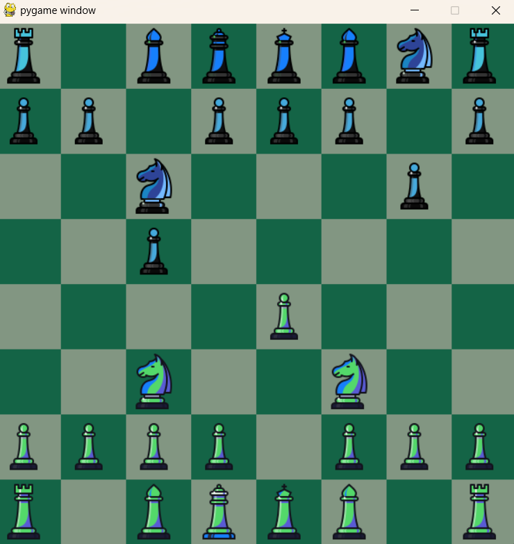

# Chess Engine

A Python-powered chess game with both human-vs-human and human-vs-AI modes, built using Pygame.

## Key Features
- **Game Mechanics**: Implements essential chess rules, including castling and checkmate detection.
- **Artificial Intelligence**:
    - **Minimax Algorithm**: Powers AI decision-making.
    - **Alpha-Beta Pruning**: Optimizes search efficiency by reducing unnecessary calculations.
    - **Move Ordering**: Prioritizes more promising moves, enhancing AI response time.
    - **Evaluation Function**: Custom, comprehensive function for position assessment.
    - **Opening Book**: Short, manually crafted for early-game strategy.
    - **Move Memory**: Retains valuable moves across sessions, allowing the engine to improve incrementally.

## Project Overview
Built during high school, this project features over 2000 lines of code and provided hands-on experience with core data structures and algorithms. I applied techniques like tree search, pruning, and memory handling to develop a strategic, fully functional chess engine.

Some areas in the code have room for refinement, but this project helped me deepen my skills in Python, algorithm design, and game development, and it was really fun to build!.
